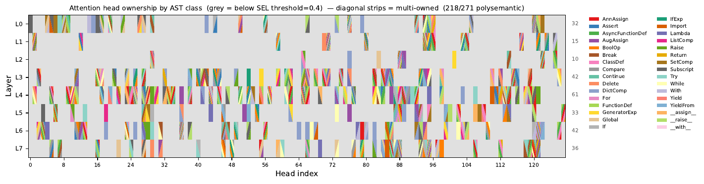
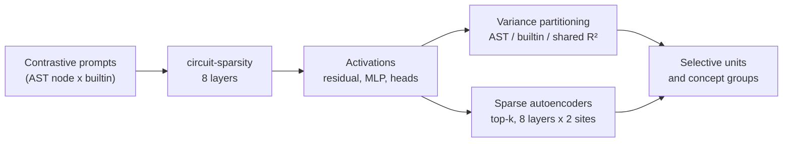
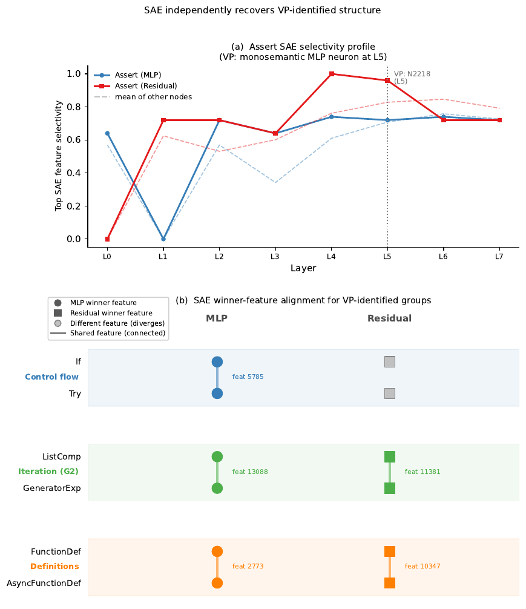

# Analysis of Universal Circuits in a CSP Transformer

Do Python syntax and Python semantics get their own dedicated units inside a
weight-sparse code language model, or are they entangled?

This is the code for our group project in COMP0087 Statistical NLP at UCL,
supervised by Karen Hambardzumyan. The full report is in
[`docs/comp0087-report.pdf`](docs/comp0087-report.pdf).

For how the project evolved from the original proposal, see
[`docs/project-history.md`](docs/project-history.md). For repository changes, see
[`Logs.md`](Logs.md).

> **Status.** Research code from a course project, provided as-is and not
> maintained. The prompt dataset used in the report ships as
> `variance_partitioning/constructor_stubs.jsonl`. Its generator is included, but
> a fresh run differs from the shipped file in 213 of 14,683 prompts, so use the
> shipped file to reproduce the report. The variance partitioning pipeline runs
> end to end. The SAE scripts need trained SAE weights, which are not included
> but can be retrained with `training/retrain.py`. The older 8,897-prompt
> contrastive dataset used by the `study_v2` replication step ships as
> `sparse_autoencoders/data/study_v2/cache/metadata_old.parquet`.
> [`exploration/`](exploration/) is kept for reference only.



## Idea

A Python snippet has two properties at once. One is its syntax, the AST node
(`For`, `If`, `Assert`). The other is its semantics, the builtin it uses (`len`,
`range`, `dict`). We ask whether OpenAI's weight-sparse code model
[`openai/circuit-sparsity`](https://huggingface.co/openai/circuit-sparsity)
encodes the two separately. If dedicated circuits exist anywhere, a sparsely
activating model is where they are most likely to surface.



- **Dataset.** 14,683 synthetic snippets covering (AST node, builtin) pairs in
  six surface variations, plus AST-only, builtin-only and proxy baselines.
- **Variance partitioning (VP).** For every residual-stream dimension, MLP
  neuron and attention head, the explained variance ($R^2$) is split into four
  parts: unique to AST, unique to builtin, shared, and unexplained.
- **Sparse autoencoders (SAEs).** A second, independent feature basis, tested
  with a discovery/held-out split and a random-feature null.
- **Delimiter control.** Every prompt is rewritten to end with `)`, so that
  groupings like `ListComp`/`Subscript` cannot just reflect the closing token.

## Conclusion

- **One monosemantic neuron.** Layer 5, MLP neuron 2218 fires for `Assert` and
  nothing else.
- **One import head.** Attention head L4H110 is tuned almost entirely to
  `import` statements. Its selectivity is 12.14, against 0.11 for the runner-up.
- **Residual-stream groups follow conceptual role, not surface syntax.**
  `ListComp` clusters with `GeneratorExp`, and `FunctionDef` with
  `AsyncFunctionDef`. The SAEs largely recover the same groupings on their own.
- **Superposition still dominates.** 218 of the 271 selective heads are
  polysemantic. Sparsity creates pockets of disentanglement, not a clean
  one-concept-per-unit model.

<p align="center">
  <br>
  <em>SAE features independently recover the Assert neuron and the VP concept groups.</em>
</p>

## Repository layout

```
variance_partitioning/  final VP pipeline on the constructor-stubs dataset
  main.py               runs every step end to end
  scripts/              extraction, VP, neuron/head selectivity, figures
sparse_autoencoders/    SAE training, feature discovery, specificity study
  study_v2/             factorial SAE study (see STUDY_DESIGN.md)
exploration/            earlier contrastive-stubs experiments (RSA, probing,
                        additivity, causal ablation) and a Streamlit dashboard
assets/                 README figures
docs/                   report PDF and project history
SETUP.md                install and full runs
```

The prompt generator and the "universal circuits" pipeline from the middle
phase of the project live in Piotr Wilam's
[CSP-Atlas](https://github.com/piotrwilam/CSP-Atlas) repository.

## Quickstart

```bash
uv venv -p 3.11 && source .venv/bin/activate
uv pip install -r requirements.txt

cd variance_partitioning && python main.py --device cuda
```

The SAE pipeline and the dashboard are covered in
[`SETUP.md`](SETUP.md).

## Authors

Asha Krishnan, Vignesh Mohanarajan, Efe Sahin, Piotr Wilam, Matt Yeung.
Supervised by Karen Hambardzumyan (UCL).

This repository is a curated copy of the group's working repository, shared
with everyone's permission. All code and results are joint work.

**Author contributions.** **Matt Yeung:** methodology, software (variance
partitioning, contrastive-stubs experiments), formal analysis, visualization,
writing. **Vignesh Mohanarajan:** methodology, software (sparse autoencoders),
formal analysis, visualization, writing. **Piotr Wilam:** methodology,
software (core CSP-Atlas prompt generation and circuit extraction idea), data
curation. **Efe Sahin:** conceptualization, literature review, software
(dashboard, pipeline maintenance), writing. **Asha Krishnan:** software,
experiments (initial experiments on the circuit-sparsity model), writing,
review and editing. **Karen Hambardzumyan:** supervision, conceptualization.

## License

The code is released under the [MIT License](LICENSE), with copyright held
jointly by the five authors. The report in
[`docs/comp0087-report.pdf`](docs/comp0087-report.pdf) is not covered by it.

## Citation

Authors are listed alphabetically, as in the report.

```bibtex
@misc{krishnan2026csp,
  title  = {Analysis of Universal Circuits in a {CSP} Transformer},
  author = {Krishnan, Asha and Mohanarajan, Vignesh and \c{S}ahin, Efe and
            Wilam, Piotr and Yeung, Matt},
  year   = {2026},
  note   = {COMP0087 Statistical NLP group project, University College London.
            Supervised by Karen Hambardzumyan}
}
```
